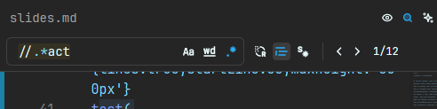

<h1 class="text-green-400">Зачем писать юнит тесты?</h1>

<!--
Так. В последние пару месяцев мы начали писать больше тестов. А сейчас вообще так грохнули все юниты на ордере и решили, что будем переписывать всё на vitest. Значит, тестов мы будем писать с вами много.

Из-за того что я провожу кучу код ревью, постоянно подмечаю, что с тестами в команде есть две проблемы. Первая это то, что я подмечаю буквально одни и ти же косяки из МРа в МР. Ладно бы косяки исправляли, но тут мне кажется, что есть вторая проблема: в команде просто есть некое несогласие с тем, что я считаю косяками.

Поэтому сегодня я не буду в роли мега гуру тестов, который познал всё и вся, а скорее обсудим, что так, что не так, что нравится и не нравится, работает, не работает. Нам нужно просто всем выбрать один список правил, с которыми все согласны, чтобы не тратить время на споры в гитлабе и лс. Раз все согласны, то и спорить будет не о чем. Но сегодня спорить НАДО. Я постараюсь меньше читать со слайдов, и больше говорить от себя, пусть и слайды я, по большей части, расписал.

Начнём мы с того, с чего я начал год назад.

ЗАЧЕМ? Зачем писать юнит тесты? На ордере их было под 7 сотен до ngxs, и мы их постепенно писали, дописывали, исправляли и прочее. 7 сотен юнитов это *много*. Месяцы работы, предполагаю. Так нафига же мы эту работу выполнили?
-->

---


<!--
Я считаю, что тесты нужны для защты от регрессий. Написали интеграционный тест на Ордере, чтобы быть уверенными, что всегда можно заказать такси - тест провалится, когда разработчик сломает эту функциональность, непрохождение теста это сигнал о возможной регрессии.

Чем больше кода, тем сложнее писать новое, не ломая старое, тем больше регрессий. Самый большой и сложный наш проект - ордер. И именно на нём это и проявляется - исправляем один баг, появляется два других.

Из этого я сам делаю вывод, что тесты мы пишем для себя же, чтобы по мере написания кода можно было отследить регрессии и не позволить им попасть в прод. Именно для разработчика, потому что именно он пишет код, он же пишет тесты, и он смотрит на результаты прогона раннера.

Так?
-->

---


<!--
Давайте я постараюсь быстренько выдать "теорию", чтоб мы могли уже обсуждать конкретные примеры.

Тесты можно охарактеризовать 3 параметрами

- Насколько тест устойчив к рефакторингу
- Как хорошо он защищает от багов
- Как быстро отрабатывает

В центр этой диаграммы мы никогда не попадём. Просто нет таких инструментов. Всегда придётся чем-то жертвовать.

У этих трёх параметров есть крайние случаи, когда мы полностью отказываемся от чего-то одного.

Откажемся от скорости - получим интеграционные или сквозные тесты. Зато покрывают кучу кода. Мы не мокаем ничего внутри самого проекта, он должен работать так же, как на проде, поэтому каждое действие в интеграционном тесте может затронуть с десяток файлов. Интеграционные тесты жертвуют временем.

Хрупкие тесты - это тесты, которые ломаются на каждый чих. Если тест сломается, потому что мы переименовали тестируемый метод - тест хрупкий.

Тривиальные тесты - это тесты, которые не защищают от багов. Пустышки.
-->

---

````md magic-move {lines:true}
```ts {all|15-23|all}
class MenuFacade {
  private readonly snackbarService = inject(SnackbarService);

  openSnackbar(msg: string, options: SnackbarOptions): void {
    snackbarService.showSnackbar(msg, options)
  }
}

describe('MenuFacade', () => {
  let facade: MenuFacade
  let snackbarService: SnackbarService

  beforeEach(() => { /* ... */ })

  // пробрасывает аргументы
  it('passes arguments', () => {
    const msg = 'test message'
    const options = { duration: 3000 }

    facade.openSnackbar(msg, options)

    expect(snackbarService.showSnackbar).toHaveBeenCalledOnceWith(msg, options)
  })
})
```

```ts {all|10-15|all}
class SomeService {
  someField = true
}

describe('SomeService', () => {
  let service: SomeService

  beforeEach(() => { /* ... */ })

  // пробрасывает аргументы
  it('passes arguments', () => {
    service.someField = false

    expect(service.someField).toBe(false)
  })
})
```
````

<!--
Тривиальный тест это тест на метод фасада. [click] Проверяем, что буквально аргументы проброшены дальше. [click:2] Или проверяем, что публичное поле компонента хранит то, что мы в него записали. [click] Абсурд. Это никому не помогает. Нет логики, и негде ошибиться. Такие тесты скорее вредны, потому что занимают те 20 миллисекунд для прогона, 5 минут на написание, а вот пользы от них нет. Они не поймают баг.
-->

---

````md magic-move {lines:true}
```ts {all|13-15|all}
class MenuFacade {
  private readonly snackbarService = inject(SnackbarService);

  openSnackbar(msg: string, options: SnackbarOptions): void {
    snackbarService.showSnackbar(msg, options)
  }
}

describe('MenuFacade', () => {
  it('passes arguments', () => {
    const facade = new MenuFacade({ showSnackbar: () => {} } as any);

    expect(String(facade.openSnackbar)).toBe(`function (msg, options) {
      this.snackbarService.showSnackbar(msg, options);
    }`);
  });
});
```

```ts
class MenuFacade {
  private readonly snackbarService = inject(SnackbarService);

  openSnackbar(message: string, options: SnackbarOptions): void {
    snackbarService.showSnackbar(msg, options)
  }
}

describe('MenuFacade', () => {
  it('passes arguments', () => {
    const facade = new MenuFacade({ showSnackbar: () => {} } as any);

    expect(String(facade.openSnackbar)).toBe(`function (msg, options) {
      this.snackbarService.showSnackbar(msg, options);
    }`);
  });
});
```
````

<!--
Хрупкий тест защищает от всех багов на 100%, при этом выполняется супер быстро. Эталонный хрупкий тест - это тест на корректную имплементацию метода. [click] Просто посимвольно сравниваем, что метод правильно написан

И как бы технически он делает то, что мы хотим от теста - защищает от багов. Идеально. Ни один не пропустит.

Я ещё не видел ни одного у нас теста, написанного так. Почему?

Конкретно этот тест мы не станем писать, потому что он сломается, если мы заменим табы на пробелы или [click:2] переименуем msg на message. Да, тест поймает 100% багов. Но кроме этого он ещё сломается, если вы подышите в его сторону.

Человек такая тварь, что если что-то постоянно не работает, то мы просто забиваем и перестаём обращать внимание. У нас на ордере постоянно падают интеграционные тесты. Я не могу забыть период, когда у нас они падали 100% времени, и мы просто не обращали на них внимание перед тем чтобы пушить код в продакшн. Флейки тесты то же самое. Они постоянно ломаются, и в какой-то момент станет похрен. Ну сломались и сломались. А по идее, это же сигнал о регрессии, и возможно какая-то функциональность работает через раз в самом приложении. Но мы забиваем, потому что ну тесты же проходят с пятого раза. С юнитами то же самое. Если они будут постоянно падать при любых изменениях, то мы просто на похрен починим его, там я не знаю, true на false в expect'е заменим, не задумываясь о том, правильно ли он вообще работал, правильно ли работает сейчас и как хорошо он написан.
-->

---

<!--
На данный момент, все ли со мной согласны? Если нет, сейчас самое время сказать "Нет, вовандрий, ты херню говоришь, идеальная форма теста - это шар."
-->

---
layout: center
---

<h1 class="text-green-400">Что такое юнит тест?</h1>

<div v-click="1">
  <div class="text-white">Это автоматизированный тест, который:</div>

  <ul>
    <li>Проверяет правильность работы одной единицы поведения — юнита</li>
    <li>Изолирует тестируемый класс от его зависимостей</li>
    <li>Работает быстро</li>
  </ul>
</div>

<!--
Различие юнитов от интеграционных. 

[click] Юниты проверяют правильность работы одной единицы поведения - юнита. Мокирует все импортируемые классы/зависимости. Работает быстро.
-->

---
layout: center
---

<h1 class="text-green-400">Что такое интеграционный тест?</h1>

<div class="pb-3">
  Это тест, который не удовлетворяет хотя бы одному из критериев юнит теста.<br>Обычно, интеграционный тест:
</div>

- Проверяет правильность работы одной или нескольких единиц поведения
- Не мокирует всё подряд
- Работает медленно

<!--
Интеграционные и сквозные тесты это тесты, которые будут ломать какие-то из правил для юнита. Медленные, не мокируют всё вокруг одного класса, и проверяют кучу разных единиц поведения.
-->

---
layout: center
---

<h1 class="text-green-400">Что такое сквозной end-to-end тест?</h1>

<div class="pb-3">это подмножество интеграционных тестов. Отличия от интеграционных:</div>

- Сквозные тесты не мокают практически никакие зависимости
- Проверяют работоспособность проекта с точки зрения конечного пользователя
- Проверяют пользовательские сценарии целиком

<!--
Сквозные тесты это интеграционные тесты, которые могут не мокировать даже апишку.
-->

---
layout: center
---

<h1 class="text-green-400 pb-4">Что нужно тестировать?</h1>

<ul>
  <li><span v-mark.highlight.red="1">Бизнес логика</span></li>
  <li>Инфраструктурный код</li>
  <li>Связующий код</li>
  <li>Внешние зависимости</li>
  <li>Отображение на фронте</li>
</ul>

<!--
Тесты писать долго и муторно, их нужно поддерживать, потому что они ломаются, плюс они усложняют рефакторинг и изменение функционала. Поэтмоу тестировать надо не всё подряд.

Для бизнеса важно, чтобы приложение работало. Если сломается мелочь типа тёмной темы, мы много клиентов не потеряем. Если на сайте заказа такси нельзя заказать такси, мы теряем деньги.

[click] Поэтому в первую очередь тестируем БИЗНЕС ЛОГИКУ.
-->

---

<!--
Достаточно теории. Я вам её уже в прошлый раз всю выдал, это так, напоминалка. Снова, все согласны?
-->

---

```yaml
layout: center
```


<!--
Теперь к примерам.

Я сразу скажу, что если вы попали в список моих анти-примеров не значит, что я ругаю вас за плохие тесты или что я считаю вас плохим программистом. Следующий пример будет от меня, и он, как мне кажется, ещё хуже. Все мы косячим, и никто из нас ещё не достиг уровня говнокода Влада или разработчиков ЭЛМА 365. Я о всех вас высокого мнения, ок?

Я запускаю playwright на mini-app и вижу это. Выглядит понятно, не пробрасываются данные в expect. Хорошо.
-->

---

```yaml
layout: center
```

```ts {all|75|66-76|all|109|126|140|154|169|186|200|227|241|255|274|286|109,126,140,154,169,186,200,227,241,255,274,286|60}{lines:true,startLine:55,maxHeight:'500px'}
test(
  CalculateOrderDescription.CHANGE_ORDER_PARAMETERS,
  async ({ page, storage }) => {
    // arrange
    let requestCount = 0;
    const expectedRequestCount = 16; // Есть дублирующие запросы, идеальный результат 14
    const base = getBaseMock({
      id: 1,
    });
    const calculateUrl = `https://dev-mos.taximaxim.ru/calculate?base=${base.id}`;

    const expectCalculateRequest = async (
      expected: Partial<CalculateRequest>
    ): Promise<void> => {
      const waitForCalculate = page.waitForRequest((req) => {
        return req.url().startsWith(calculateUrl) && req.method() === 'POST';
      });
      const data = (await waitForCalculate).postDataJSON();
      expectedCalculate.uid = data.uid;

      expect(data).toMatchObject(expected);
    };

    const expectedCalculate: Partial<CalculateRequest> = {
      uid: null,
      addresses: [{ coordinates: addressList[0].coordinates }],
      tariffTypes: [tariffTypes[0].id],
      addPrices: [],
      orderId: null,
      startTime: null,
    };

    // Request counter
    page.on('request', (request) => {
      if (request.url().includes(calculateUrl)) requestCount++;
    });

    // arrange: storage
    await storage.predefine([{ key: StorageKey.BASE, value: base }]);

    // act
    await page.goto('/');

    // act: preconditions check
    expect(await isGeolocationGranted(page)).toBe(false);

    // act: create order
    // act: select addresses
    await page.getByRole('button').filter({ hasText: 'Куда поедете' }).click();
    await page
      .getByRole('button')
      .filter({ hasText: 'Скажу водителю' })
      .click();

    await expectCalculateRequest(expectedCalculate);

    // act: change first address to
    await page
      .getByRole('button')
      .filter({ hasText: 'Скажу адрес водителю' })
      .click();
    await page.getByPlaceholder('Введите адрес для поиска').fill('Пушкина');

    expectedCalculate.addresses!.push({
      coordinates: addressList[2].coordinates,
    });
    await Promise.all([
      page
        .getByRole('listitem')
        .filter({ hasText: addressList[2].title! })
        .click(),
      expectCalculateRequest(expectedCalculate),
    ]);

    // act: change address from
    await page.getByRole('button').filter({ hasText: 'Ленина, 1' }).click();

    expectedCalculate!.addresses![0] = {
      coordinates: addressList[3].coordinates,
    };
    await Promise.all([
      page
        .getByRole('listitem')
        .filter({ hasText: addressList[3].title! })
        .click(),
      expectCalculateRequest(expectedCalculate),
    ]);

    // act: add second address to
    await page.getByTestId('add-address-btn').click();

    expectedCalculate.addresses!.push({
      coordinates: addressList[1].coordinates,
    });
    await Promise.all([
      page
        .getByRole('listitem')
        .filter({ hasText: addressList[1].title! })
        .click(),
      expectCalculateRequest(expectedCalculate),
    ]);

    // act: select payment
    await page.getByTestId('payment-card').click();
    const paymentDialog = page
      .getByRole('dialog')
      .filter({ hasText: 'Способы оплаты' });
    await expect(paymentDialog).toBeVisible();

    await Promise.all([
      paymentDialog
        .getByRole('button')
        .filter({ hasText: 'Перевод на сбербанк' })
        .click(),
      expectCalculateRequest(expectedCalculate),
    ]);

    await expect(paymentDialog).toBeHidden();

    // act: select tariff
    await page.getByTestId('tariffs-card').click();
    const tariffDialog = page.getByRole('dialog').filter({ hasText: 'Такси' });
    await expect(tariffDialog).toBeVisible();

    await tariffDialog.getByRole('button').filter({ hasText: 'Такси' }).click();
    // переключаем на другую группу тарифов, при этом очищается tariffTypes
    expectedCalculate.tariffTypes = [];

    // act: select first tariff types
    expectedCalculate.tariffTypes.push(tariffTypes[2].id);
    await Promise.all([
      expectCalculateRequest(expectedCalculate),
      tariffDialog
        .getByRole('listitem')
        .filter({ hasText: tariffTypes[2].name })
        .click(),
    ]);

    // act: select second tariff types
    expectedCalculate.tariffTypes.push(tariffTypes[3].id);
    await Promise.all([
      tariffDialog
        .getByRole('listitem')
        .filter({ hasText: tariffTypes[3].name })
        .click(),
      expectCalculateRequest(expectedCalculate),
    ]);

    await tariffDialog
      .getByRole('button')
      .filter({ hasText: 'Готово' })
      .click();
    await expect(tariffDialog).toBeHidden();

    // act: select tariff options
    await page.getByTestId('tariff-options-card').click();
    const tariffOptionsDialog = page
      .getByRole('dialog')
      .filter({ hasText: 'Детали заказа' });
    await expect(tariffOptionsDialog).toBeVisible();

    const addPrice1 = tariffOptionsDialog
      .getByRole('listitem')
      .filter({ hasText: tariffOptions[0].name });

    expectedCalculate.addPrices!.push({
      value: '1',
      id: tariffOptions[0].id,
      key: tariffOptions[0].type,
    });
    await Promise.all([
      addPrice1.getByTestId('ui-switch').click(),
      expectCalculateRequest(expectedCalculate),
    ]);

    const addPrice2 = tariffOptionsDialog
      .getByRole('listitem')
      .filter({ hasText: tariffOptions[1].name });

    expectedCalculate.addPrices!.push({
      value: '5',
      id: tariffOptions[1].id,
      key: tariffOptions[1].type,
    });
    await Promise.all([
      addPrice2.getByRole('textbox').fill('5'),
      expectCalculateRequest(expectedCalculate),
    ]);

    const addPrice3 = tariffOptionsDialog
      .getByRole('listitem')
      .filter({ hasText: tariffOptions[2].name });

    expectedCalculate.addPrices!.push({
      value: 'Example',
      id: tariffOptions[2].id,
      key: tariffOptions[2].type,
    });
    await Promise.all([
      addPrice3.getByRole('textbox').fill('Example'),
      expectCalculateRequest(expectedCalculate),
    ]);

    const addPrice4 = tariffOptionsDialog
      .getByRole('listitem')
      .filter({ hasText: tariffOptions[3].name });
    await addPrice4.getByTestId('ui-switch').click();
    const targetVariant = addPrice4.locator(
      `label:has-text("${tariffOptions[3].variants[1].value}")`
    );
    await expect(targetVariant).toBeEnabled();

    expectedCalculate.addPrices!.push({
      value: tariffOptions[3].variants[1].key,
      id: tariffOptions[3].id,
      key: tariffOptions[3].type,
    });
    await Promise.all([
      targetVariant.click(),
      expectCalculateRequest(expectedCalculate),
    ]);

    await page
      .getByPlaceholder('Введите дополнительную информацию...')
      .fill('test description');

    await Promise.all([
      tariffOptionsDialog
        .getByRole('button')
        .filter({ hasText: 'Готово' })
        .click(),
      expectCalculateRequest(expectedCalculate),
    ]);

    await expect(tariffOptionsDialog).toBeHidden();

    // assert
    expect(requestCount).toEqual(expectedRequestCount);
  }
);
```

<!--
Открываю тест [click] Смотрю 75 строку. [click] В блоке вот этой функции. Она ждёт запрос на `/calculate`. [click] Внутри теста.

[click] Тест может ломаться здесь.

[click:12] 12 вызовов. Один из них ломается. Вот они все по файлу. Я добавил debounce на запрос, и убрал дубликаты. Вопрос знатокам, какой из 12 вызовов сломался?

[click] Напоминаю, кстати, что запросов должно быть 16. Вызовов 12.
-->

---


<!--
Просто чтобы отдебажить этот тест, мне пришлось рассыпать console.log'и буквально после каждой строки.

С этим тестом крайне тяжело работать.
-->

---



<!--
12 вхождений комментария act. Это только комментарий, там ближе к концу просто комменты уже потерялись, мне кажется.

В итоге я потратил на исправление одного теста часов 5, но уже не помню.

Что мы можем с этим сделать? 

...Мы придерживаемся паттерна ААА. Arrange, Act, Assert. В юнит тестах мы делаем строгий лимит на 1 блок act, и только изредка допускаем больше одного вызова в нём. Да, интеграционные тесты не обязаны иметь ровно один блок act. Но это же пиздец.
-->

---

```yaml
layout: center
```

```ts {all|12-48|50-52|all|58-60|58|59|12-20|14|20|2-10|22-25|12-48|all}{lines:true,maxHeight:'500px'}
describe('should assign correct src path', () => {
  interface TestData {
    isDarkTheme?: boolean;
    isCrimea?: boolean;
    expectedTheme?: string;
    actualLocale?: string;
    expectedLocale?: string;
    actualStore?: AppLinkStore;
    expectedStore?: AppLinkStore;
  }

  function test({
    isDarkTheme = false,
    isCrimea = false,
    expectedTheme = 'light',
    actualLocale = 'en',
    expectedLocale = 'en',
    actualStore = AppLinkStore.GOOGLE_PLAY,
    expectedStore = AppLinkStore.GOOGLE_PLAY,
  }: TestData): void {
    // arrange
    setAppLinks({
      appLinks: { [actualStore]: '' },
      region: isCrimea ? AppLinkRegion.CRIMEA : AppLinkRegion.GLOBAL,
    });
    const actual: Badge[][] = [];
    const appConfig: Partial<AppConfig> = { locale: 'ru', localeIr: 'ir' };

    TestBed.overrideProvider(LOCALE_ID, { useValue: actualLocale });
    TestBed.overrideProvider(APP_CONFIG_TOKEN, { useValue: appConfig });
    TestBed.overrideProvider(IS_DARK_THEME$, { useValue: of(isDarkTheme) });

    service = TestBed.inject(BadgeService);

    // act
    service
      .getBadgesByCountry(getMockedCountry({ code: 'ru' }))
      .pipe(tap((b) => actual.push(b)))
      .subscribe();
    tick(2000);

    // assert
    expect(actual.length).toEqual(1);
    expect(actual[0].length).toEqual(1);
    expect(actual[0][0].src).toEqual(
      `assets/img/${expectedTheme}/app-link-${expectedStore}-${expectedLocale}.svg`
    );
  }

  it('for ru locale', fakeAsync(() => {
    test({ actualLocale: 'ru', expectedLocale: 'ru' });
  }));

  it('for ir locale', fakeAsync(() => {
    test({ actualLocale: 'ir', expectedLocale: 'ir' });
  }));

  it('for wrong locale', fakeAsync(() => {
    test({ actualLocale: 'asdfadf', expectedLocale: 'en' });
  }));

  it('for en locale', fakeAsync(() => {
    test({ actualLocale: 'en', expectedLocale: 'en' });
  }));

  it('for dark theme', fakeAsync(() => {
    test({ isDarkTheme: true, expectedTheme: 'dark' });
  }));

  it('for light theme', fakeAsync(() => {
    test({ isDarkTheme: false, expectedTheme: 'light' });
  }));

  it('for google play', fakeAsync(() => {
    test({
      actualStore: AppLinkStore.GOOGLE_PLAY,
      expectedStore: AppLinkStore.GOOGLE_PLAY,
    });
  }));

  it('for apk', fakeAsync(() => {
    test({
      actualStore: AppLinkStore.APK,
      expectedStore: AppLinkStore.APK,
    });
  }));

  it('for AppStore', fakeAsync(() => {
    test({
      actualStore: AppLinkStore.APP_STORE,
      expectedStore: AppLinkStore.APP_STORE,
    });
  }));
});
```

<!--
Теперь покажу вам, какую прелесть я вот этими руками написал. Я попрошу вас вчитаться в тест и понять его смысл. Контекст - это сервис, который формирует массив бейджиков для скачивания приложения.

[click] глобальная моя идея была в том, что я один раз напишу мега-функцию `test()`

[click] а потом переиспользовать её для конкретных параметров

[click] Итак. Читаем тест. Читаем так, как если бы мы пришли сюда в первый раз. 

[click] Скажем, вот этот тест упал. [click] "Для неправильной локали". Что для неправильной локали? 
-->

---

```yaml
layout: center
```

```ts {all|9|9-14|16-17|18-25|all}{lines:true}
describe('MapService', () => {
  let service: MapService;
  let http: jest.Mocked<HttpClient>;
  let cache: jest.Mocked<AppCacheService>;
  let map: any;

  beforeEach(() => { /* ... */ });

  it('Fetches data from API and saves to cache when cache is empty', (done) => {
    // Arrange
    const placeId = 123;
    const apiResponse = [{ id: 'zone-1' }];
    cache.get.mockReturnValue(null);
    http.get.mockReturnValue(of(apiResponse));

    // Act
    service.getZones(placeId).subscribe((data) => {
      // Assert
      expect(data).toEqual(apiResponse);
      expect(http.get).toHaveBeenCalledWith('/zones', {
        params: new HttpParams().set('id', placeId),
      });
      expect(cache.set).toHaveBeenCalledWith(expect.any(String), { '123': apiResponse }, expect.any(Number));
      done();
    });
  });
});
```

<!--
А теперь бойтесь. Это самый сложный тест на report-map, который я смог найти. Искал я, правда, поверхностно.

Начинаем читать, без контекста. Сервис Карты, MapService [click] "Фетчит данные с АПИшки и кэширует их. Хорошо, довольно понятно.

[click] Окей, создаём пару констант, мокируем получение кэша, т.е. cache.get, и апишку через http.get.

[click] Получаем зоны по константе внутри теста.

[click] Это RxJS, поэтому имеем вложенный assert. Нехорошо так делать, но rxjs это rxjs. Ага, проверяем, что апи вернёт то, что мы и ожидали. Проверяем, что API вызвали по такому-то пути с тем параметром, который нам и нужен для определения зон. И что в кэш записалось новое значение.

[click] Как можно улучшить этот страшный, ужасно написанный тест?
-->

---

```yaml
layout: center
```

```ts {80-104|all}{lines:true,maxHeight:'500px'}
describe('shouldNotRequire', () => {
  [
    {
      fields: [
        {
          code: 'name',
          name: 'Имя',
          isRequired: true,
          isEditable: true,
        },
        {
          code: 'surname',
          name: 'Фамилия',
          isRequired: true,
          isEditable: true,
        },
        {
          code: 'patronymic',
          name: 'Отчество',
          isRequired: true,
          isEditable: true,
        },
      ],
      shouldNotRequire: true,
      testName: 'all',
    },
    {
      fields: [
        {
          code: 'name',
          name: 'Имя',
          isRequired: false,
          isEditable: true,
        },
        {
          code: 'surname',
          name: 'Фамилия',
          isRequired: false,
          isEditable: true,
        },
        {
          code: 'patronymic',
          name: 'Отчество',
          isRequired: false,
          isEditable: true,
        },
      ],
      shouldNotRequire: false,
      testName: 'all',
    },
    {
      fields: [
        {
          code: 'name',
          name: 'Имя',
          isRequired: true,
          isEditable: true,
        },
        {
          code: 'surname',
          name: 'Фамилия',
          isRequired: false,
          isEditable: true,
        },
        {
          code: 'patronymic',
          name: 'Отчество',
          isRequired: false,
          isEditable: true,
        },
      ],
      shouldNotRequire: true,
      testName: 'at least one',
    },
  ].forEach(({ fields, shouldNotRequire, testName }) => {
    const mandatoryProfileField = getMockedMandatoryProfileField({
      fields,
    });

    it(`returns ${shouldNotRequire} if ${testName} has isRequired ${shouldNotRequire}`, () => {
      // act
      const result = ProfileRequiredService.hasEmptyRequiredFields(
        profile,
        mandatoryProfileField
      );

      // assert
      expect(result).toBe(shouldNotRequire);
    });
  });

  it(`returns false if profile is not defined`, () => {
    // arrange
    const mandatoryProfileField = getMockedMandatoryProfileField();

    // act
    const result = ProfileRequiredService.hasEmptyRequiredFields(
      null,
      mandatoryProfileField
    );

    // assert
    expect(result).toBeFalse();
  });
});
```

---

```yaml
layout: center
```

```ts
[false, undefined].forEach((hint) => {
  it(`should not display logo & hints when hasHint and hasLogo are ${hint}, detailHint is empty`, () => {
    createComponent({
      hasLogo: hint,
      detailHint: '',
      isEditable: true,
    });

    defineElements();
    
    expect(logoEl).not.toBeDefined();
    expect(hintEl).toBeDefined();
    expect(detailHintEl).not.toBeDefined();
  });
});
```

<!--
-->

---

```ts {all}{lines:true,maxHeight:'480px'}
type VisibleParamsTestCase = {
  visibleParams: Pick<
    NonNullable<Service['visibleParams']>,
    'visibleType' | 'defaultVisibleType'
  >;
  expectedServicesLength: number;
};

const visibleParamsCases: VisibleParamsTestCase[] = [
  {
    visibleParams: {
      visibleType: VisibleType.VISIBLE,
      defaultVisibleType: VisibleType.HIDDEN,
    },
    expectedServicesLength: 1,
  },
  {
    visibleParams: {
      visibleType: VisibleType.HIDDEN,
      defaultVisibleType: VisibleType.HIDDEN,
    },
    expectedServicesLength: 0,
  },
  {
    visibleParams: {
      visibleType: null,
      defaultVisibleType: VisibleType.VISIBLE,
    },
    expectedServicesLength: 1,
  },
  {
    visibleParams: {
      visibleType: null,
      defaultVisibleType: VisibleType.HIDDEN,
    },
    expectedServicesLength: 0,
  },
];

visibleParamsCases.forEach(({ visibleParams, expectedServicesLength }) => {
  it(`should be returned ${expectedServicesLength} services when visibleType is: ${visibleParams.visibleType}, defaultVisibleType is: ${visibleParams.defaultVisibleType}`, () => {
    // arrange
    const showingPlace = DetailShowingPlaces.ORDER_SCREEN;
    const mockedServices = [
      getMockedService({
        showingPlace,
        visible: false,
        visibleParams: {
          ...visibleParams,
          params: null,
          disableDescription: null,
        },
      }),
    ];
    const order = getMockedOrder({
      tariff: [getMockedTariff({ services: mockedServices })],
    });
    initService();
    // act
    expectedServices = service.selectAllowedServices(order, [showingPlace]);
    // assert
    expect(expectedServices.length).toBe(expectedServicesLength);
  });
});
```

---

```yaml
layout: center
```

```ts
//act
// 1. Visit the website
cy.visit('/');
```

---

```yaml
layout: center
```

```ts {all}{lines:true,maxHeight:'500px'}
test(TestDescription.CREATE_HYGIENE, async ({ page }) => {
  // arrange
  const { faker, mainPage, dashboard, team, prDialog } = getPageObjects(page);
  const mocks = PR_MOCKS[TestDescription.CREATE_HYGIENE]!;

  await mockCommonNetworkPrOperations(faker, mocks);

  const expectedGrade = PR_TYPE_LABELS[PrType.HYGIENE];
  const expectedDateDue = '—';
  const expectedStatus = 'Новый';
  const expectedRequest: Partial<CreatePrRequest> = {
    type: PrType.HYGIENE,
    dateDue: '',
    dateReview: '2077-07-07T00:00:00.000Z',
  };
  const httpWatcher = getHttpWatcher(
    page,
    '/api/reviews/profile/' + mocks.getProfileTeam![1].id!,
    'POST'
  );

  await page.clock.setFixedTime(new Date(expectedRequest.dateReview!));

  // act
  await mainPage.navigate();
  await dashboard.selectTeamMember(mocks.getProfileTeam![1].fullName!);

  await expect(mainPage.alert).toBeHidden();

  await prDialog.openCreateDialog();
  await prDialog.fillHygieneCreateForm();

  // check handle error
  await faker.reviews.mockCreatePrApiError();
  await prDialog.submitBtn.click();
  await mainPage.checkApiErrorNotificationIsVisible();
  await expect(
    team.prListTable.filter({ hasText: 'Пока здесь пусто' })
  ).toBeVisible();

  await faker.reviews.mockProfileReviews({ post: { params: mocks.createPr } });

  await prDialog.submitForm();

  const response = await httpWatcher;

  // assert
  expect(response.request().postDataJSON()).toMatchObject(expectedRequest);
  await Promise.all([
    mainPage.checkNotificationIsVisible('Performance Review добавлен'),
    expect(
      team.prListTable.getByRole('row', {
        name: `${expectedGrade} ${expectedDateDue} ${expectedStatus}`,
      })
    ).toBeVisible(),
  ]);
});
```

---

```yaml
layout: center
```

```ts {all}{lines:true,maxHeight:'500px'}
test(
  OrderDescription.CREATE_ORDER_WITH_UNKNOWN_ERROR,
  async ({ page, faker, storage }) => {
    // arrange
    const base = getBaseMock({
      id: 100,
    });

    // arrange: network
    await faker.bases.mock({
      get: { params: mocks.getBases },
    });
    await faker.auth.mock({ post: { params: mocks.auth } });
    await faker.featureToggles.mock({
      get: { params: mocks.featureToggles },
    });
    await faker.fillingSettings.mock({
      get: { params: mocks.getFillingSettings },
    });
    await faker.profile.mock({ get: { params: mocks.getProfile } });
    await faker.addressesByCoordinates.mock({
      get: { params: mocks.getAddressesByCoordinates },
    });
    await faker.tariffCategories.mock({
      get: { params: mocks.getTariffCategories },
    });
    await faker.tariffTypes.mock({
      get: { params: mocks.getTariffTypes },
    });
    await faker.patterns.mock({
      get: { params: mocks.getPatterns },
    });
    await faker.meetpoints.mock({
      get: { params: mocks.getMeetpoints },
    });
    await faker.addresses.mock({
      get: { params: mocks.getAddresses },
    });
    await faker.calculate.mock({
      post: { params: mocks.calculate },
    });
    await faker.orders.mock({
      post: { fulfillParams: { status: 500 } },
      get: { params: mocks.getOrders },
    });

    const waitForOrder = page.waitForRequest((req) => {
      return (
        req.url().startsWith('https://dev-mos.taximaxim.ru/orders') &&
        req.method() === 'POST'
      );
    });

    // arrange: storage
    await storage.predefine([{ key: StorageKey.BASE, value: base }]);

    // act
    await page.goto('/');

    await page.getByRole('button').filter({ hasText: 'Куда поедете' }).click();
    await page.getByPlaceholder('Введите адрес для поиска').fill('Пушкина');
    await page
      .getByRole('listitem')
      .filter({ hasText: addressList[2].title! })
      .click();
    await page.getByRole('button').filter({ hasText: 'Заказать' }).click();
    await waitForOrder;

    // assert
    const resultDialog = page
      .getByRole('dialog')
      .filter({ hasText: 'Ошибка' })
      .filter({ hasText: 'Свяжитесь с оператором или попробуйте позже' });

    await expect(
      resultDialog.getByRole('button').filter({ hasText: 'Вернуться в чат' })
    ).toBeVisible();
  }
);
```

---

```yaml
layout: center
```

```ts {all}{lines:true,maxHeight:'500px'}
test(
  OrderDescription.CREATE_ORDER_WITH_UNKNOWN_ERROR,
  async ({ page, faker, storage }) => {
    // arrange
    const base = getBaseMock({
      id: 100,
    });

    // arrange: network
    await justMockEverything(mocks[OrderDescription.CREATE_ORDER_WITH_UNKNOWN_ERROR])
    
    const waitForOrder = page.waitForRequest((req) => {
      return (
        req.url().startsWith('https://dev-mos.taximaxim.ru/orders') &&
        req.method() === 'POST'
      );
    });

    // arrange: storage
    await storage.predefine([{ key: StorageKey.BASE, value: base }]);

    // act
    await page.goto('/');

    await page.getByRole('button').filter({ hasText: 'Куда поедете' }).click();
    await page.getByPlaceholder('Введите адрес для поиска').fill('Пушкина');
    await page
      .getByRole('listitem')
      .filter({ hasText: addressList[2].title! })
      .click();
    await page.getByRole('button').filter({ hasText: 'Заказать' }).click();
    await waitForOrder;

    // assert
    const resultDialog = page
      .getByRole('dialog')
      .filter({ hasText: 'Ошибка' })
      .filter({ hasText: 'Свяжитесь с оператором или попробуйте позже' });

    await expect(
      resultDialog.getByRole('button').filter({ hasText: 'Вернуться в чат' })
    ).toBeVisible();
  }
);
```

---

```yaml
layout: center
```

````md magic-move {lines:true}
```ts {all|8-11}
it('should show icon when collapsed', () => {
  // arrange
  initComponent({ isCollapsed: true });

  // act
  fixture.detectChanges();

  // assert
  const icon = fixture.debugElement.query(
    By.css('[data-testid="badge-collapse-button__icon"]')
  );

  expect(icon).toBeDefined();
});
```

```ts {all|10-13}
import { getDebugElementByTestId } from '...';

it('should show icon when collapsed', () => {
  // arrange
  initComponent({ isCollapsed: true });

  // act
  fixture.detectChanges();

  // assert
  const icon = getDebugElementByTestId(
    'badge-collapse-button__icon'
  )

  expect(icon).toBeDefined();
});
```

```ts {all|5-9}
describe('should assign correct src path', () => {
  interface TestData { ... }

  function test({ ... }: TestData): void {
    // arrange
    setAppLinks({
      appLinks: { [actualStore]: '' },
      region: isCrimea ? AppLinkRegion.CRIMEA : AppLinkRegion.GLOBAL,
    });
    const actual: Badge[][] = [];
    const appConfig: Partial<AppConfig> = { locale: 'ru', localeIr: 'ir' };

    TestBed.overrideProvider(LOCALE_ID, { useValue: actualLocale });
    TestBed.overrideProvider(APP_CONFIG_TOKEN, { useValue: appConfig });
    TestBed.overrideProvider(IS_DARK_THEME$, { useValue: of(isDarkTheme) });

    // ...
  }
})
```

```ts {all}
describe('should assign correct src path', () => {
  interface TestData { ... }

  function test({ ... }: TestData): void {
    // arrange
    setAppLinks({
      appLinks: { [actualStore]: '' },
      region: isCrimea ? AppLinkRegion.CRIMEA : AppLinkRegion.GLOBAL,
    });
    const actual: Badge[][] = [];
    const appConfig: Partial<AppConfig> = { locale: 'ru', localeIr: 'ir' };

    TestBed.overrideProvider(LOCALE_ID, { useValue: actualLocale });
    TestBed.overrideProvider(APP_CONFIG_TOKEN, { useValue: appConfig });
    TestBed.overrideProvider(IS_DARK_THEME$, { useValue: of(isDarkTheme) });

    // ...
  }
})
```
````

---

```yaml
layout: center
```

```ts {*}{lines:true,maxHeight:'500px'}
it('Forwards arguments for update destination address', () => {
  // Arrange
  const mockInput = {
    pointIndex: 1,
    comment: 'testComment',
    source: OrderParamsSource.FORM,
  };

  const mockOrder = getMockedOrder({
    addressTo: [
      getMockedAddress({
        title: 'Mocked address 1',
        isFull: true,
        latitude: 55.444729,
        longitude: 65.342224,
        place: {
          id: 1,
          name: 'Курган',
          description: '',
          hasAddresses: null,
        },
        comment: mockInput.comment,
      }),
    ],
  });

  storeSpy.selectSnapshot
    .withArgs(AppSelectors.order)
    .and.returnValue(mockOrder);

  // Act
  service.setMeetingPoint(
    mockInput.comment,
    mockInput.pointIndex,
    mockInput.source
  );

  // Assert
  expect(storeSpy.dispatch).toHaveBeenCalledWith(
    new OrderAddressServiceActions.AddressTo.Update.WhenMeetingPointUpdated(
      {
        params: {
          addressTo: mockOrder.addressTo,
        },
        source: mockInput.source,
      }
    )
  );
});
```

---

```yaml
layout: center
```

<h1 class="text-green-400">AAAAAAAAAA</h1>

````md magic-move {lines:true}
```ts {*|2-7|9-10|12-13|*} twoslash
it('Purchase succeeds when enough inventory', () => {
  // Arrange
  const apiServiceMock = {
    makePurchase: jest.fn(),
    getItemCount: jest.fn().mockReturnValue(15),
  }
  service = TestBed.inject(StoreService)

  // Act
  service.purchase(Product.SHAMPOO, 5)

  // Assert
  expect(apiServiceMock.makePurchase).toHaveBeenCalledTimes(1)
})
```

```ts {*} twoslash
it('Purchase succeeds when enough inventory', () => {
  const apiServiceMock = {
    makePurchase: jest.fn(),
    getItemCount: jest.fn().mockReturnValue(15),
  }
  service = TestBed.inject(StoreService)

  service.purchase(Product.SHAMPOO, 5)

  expect(apiServiceMock.makePurchase).toHaveBeenCalledTimes(1)
})
```

```ts {*|11-|*} twoslash
it('Purchase succeeds when enough inventory', () => {
  // Arrange
  const apiServiceMock = {
    makePurchase: jest.fn(),
    getItemCount: jest.fn()
      .mockReturnValueOnce(15)
      .mockReturnValue(5),
  }
  service = TestBed.inject(StoreService)

  // Act
  service.purchase(Product.SHAMPOO, 5)

  // Assert
  expect(apiServiceMock.makePurchase).toHaveBeenCalledTimes(1)

  // Act
  service.purchase(Product.MACARONI, 15)

  // Assert
  expect(apiServiceMock.makePurchase).not.toHaveBeenCalled()
})
```

```ts {*|14-19|*} twoslash
it('Purchase succeeds when enough inventory', () => {
  // Arrange
  const shampooInInventory = 15
  const shampooToPurchase = 5
  const apiServiceMock = {
    makePurchase: jest.fn(),
    getItemCount: jest.fn().mockReturnValue(shampooInInventory),
  }
  service = TestBed.inject(StoreService)

  // Act
  service.purchase(Product.SHAMPOO, shampooToPurchase)

  // Assert
  if (shampooInInventory < shampooToPurchase) {
    expect(apiServiceMock.makePurchase).toHaveBeenCalledTimes(1)
  } else {
    expect(apiServiceMock.makePurchase).not.toHaveBeenCalled()
  }
})
```

```ts {*} twoslash
it('Purchase succeeds when enough inventory', () => {
  const apiServiceMock = {
    makePurchase: jest.fn(),
    getItemCount: jest.fn().mockReturnValue(15),
  }
  service = TestBed.inject(StoreService)

  service.purchase(Product.SHAMPOO, 5)

  expect(apiServiceMock.makePurchase).toHaveBeenCalledTimes(1)
})

it("Purchase fails when not enough inventory", () => {
  const apiServiceMock = {
    makePurchase: jest.fn(),
    getItemCount: jest.fn().mockReturnValue(5),
  }
  service = TestBed.inject(StoreService)

  service.purchase(Product.SHAMPOO, 15)

  expect(apiServiceMock.makePurchase).not.toHaveBeenCalled()
})
```

```ts {*|2-7} twoslash
it('Purchase succeeds when enough inventory', () => {
  // Arrange
  const apiServiceMock = {
    makePurchase: jest.fn(),
    getItemCount: jest.fn().mockReturnValue(15),
  }
  service = TestBed.inject(StoreService)

  // Act
  service.purchase(Product.SHAMPOO, 5)

  // Assert
  expect(apiServiceMock.makePurchase).toHaveBeenCalledTimes(1)
})
```

// step 7
```ts {3} twoslash
it('Purchase succeeds when enough inventory', () => {
  // Arrange
  const apiServiceMock = makeStoreWithShampoo(15)
  service = TestBed.inject(StoreService)

  // Act
  service.purchase(Product.SHAMPOO, 5)

  // Assert
  expect(apiServiceMock.makePurchase).toHaveBeenCalledTimes(1)
})
```

// step 8
```ts {*|1,9-14|17-|*} twoslash
const test = (inStore, toPurchase, shouldCall) => {
  // Arrange
  const apiServiceMock = makeStoreWithShampoo(inStore)
  service = TestBed.inject(StoreService)

  // Act
  service.purchase(Product.SHAMPOO, toPurchase)

  // Assert
  if (shouldCall) {
    expect(apiServiceMock.makePurchase).toHaveBeenCalledTimes(1)
  } else {
    expect(apiServiceMock.makePurchase)not.toHaveBeenCalled()
  }
}

it('Purchase succeeds when enough inventory', () => test(15, 5, true))

it('Purchase fails when not enough inventory', () => test(5, 15, false))
```

// step 8
```ts {*} twoslash
const test = (inStore, toPurchase, shouldCall) => { /* ... */ }

it('Purchase succeeds when enough inventory', () => test(15, 5, true))

it('Purchase fails when not enough inventory', () => test(5, 15, false))
```

// step 8
```ts {*|3-} twoslash
const test = ({ inStore, toPurchase, shouldCall }) => { /* ... */ }

it('Purchase succeeds when enough inventory', () => test({
  shampooInStore: 15,
  shampooToPurchase: 5,
  shouldSucceed: true,
)})

it('Purchase fails when not enough inventory', () => test({
  shampooInStore: 5,
  shampooToPurchase: 15,
  shouldSucceed: false,
}))
```
````

<!--
Поговорим об анатомии тестов. Принято делить внутренности на три секции. У нас в команде довольно давно распространён паттерн ААА - Arrange Act Assert. Бэкендеры в курсе, что это такое?

(ААА - это паттерн, при котором тесты разибваются на три секции - [click] подготовка или arrange, [click] действие или act и [click] проверка или assert.)

[click] Паттерн довольно полезный, так как сильно помогает с читаемостью теста. Ну и простой, это буквально три комментария. У меня даже сниппет есть для их вставки.

[click] Убирайте комментарии для небольших тестов. Это не мешает читаемости, так как секции легко выделяются с помощью пустых строк

[click] Вот так в юнит тестах делать нельзя, каждая секция встречается только один раз. Помним, юнит тесты проверяют одну единицу поведения. [click] Когда у вас дублируются секции, это красный флаг, означающий, что вы проверяете больше, чем одну единицу поведения.

Интеграционные тесты могут себе такое позволить. Иметь множество секций нежелательно, но можно. Стоит делать это тогда, когда после выполнения одного теста система готова к выполнению другого теста, **и когда тест происходит медленно**. Две несвязанные единицы поведения объединять не стоит. Два быстрых интеграционных теста объединять в один тоже не стоит, просто напишите два.

[click:2] Ветвить в тестах тоже нельзя. [click] `if`'ы в тестах тоже означают, что вы проверяете слишком много всего, и вам нужно разбить тесты на разные.

[click:2] Вместо if'ов и дубликатов секций лучше напишите два разных теста. Юнит тесты происходят быстро, время прогона при этом увеличится ну на пару милисекунд. Если это не интеграционные тесты. И даже так, читаемость важна. Поэтому семь раз подумайте, один раз склейте два теста в один.

[click] Подробнее про каждую из секций. [click] Arrange или подготовка обычно самая большая секция, особенно в интеграционных тестах.

[click] Используйте фабрики для тестовых данных и моков, упрощайте код в секции подготовки. Я знаю, что во фронте мы всё подряд выносим в фабрики, и это классно.

[click] Полностью тесты выносить в фабрики плохо. Я так делал, и это привело к нечитаемым тестам. Не надо так. [click] Сама фабрика теста часто будет включать в себя кучу параметров, условия в секции проверок. Это делает ТОЛЬКО хуже. [click] Вызовы фабрики тоже непонятны.

[click:4] Частично ситуацию можно исправить, если назвать аргументы, но даже так читать это тяжело и не понятно, что вообще из себя представляет тест. Слишком много всего убрано, и приходится бегать глазами по всему файлу.
-->

---
layout: center
---

<h1 v-click="3" class="text-green-400">Параметризованные тесты</h1>

````md magic-move {lines: true}
// step
```ts {*}
it('Delivery with a past date is invalid', () => {
  const delivery = makeDelivery({ date: makeRelativeDate(-1) })
  service = TestBed.inject(DeliveryService)

  const actual = service.isDeliveryValid({ date })

  expect(actual).toBeFalsy()
})
```

```ts {*}
it('Delivery with a past date is invalid', () => {
  const delivery = makeDelivery({ date: makeRelativeDate(-1) })
  service = TestBed.inject(DeliveryService)

  const actual = service.isDeliveryValid({ date })

  expect(actual).toBeFalsy()
})

it('Delivery for today is invalid', () => { /* ... */ })
it('Delivery for tomorrow is valid', () => { /* ... */ })
it('Delivery in 1 month is valid', () => { /* ... */ })
it('Delivery in 3 months is invalid', () => { /* ... */ })
```

```ts {*}
it('Delivery with a past date is invalid')
it('Delivery for today is invalid')
it('Delivery for tomorrow is valid')
it('Delivery in 1 month is valid')
it('Delivery in 3 months is invalid')
```

```ts {*}
[
  [-1, false],
  [0, false],
  [1, true],
  [28, true],
  [90, false],
].forEach(([daysFromNow, expected]) => {
  it('Validates delivery date', () => {
    const delivery = makeDelivery({ date: makeRelativeDate(daysFromNow) })
    service = TestBed.inject(DeliveryService)

    const actual = service.isDeliveryValid({ date })

    expect(actual).toBe(expected)
  })
})
```

```ts {*}
[
  { daysFromNow: -1, expected: false },
  { daysFromNow: 0, expected: false },
  { daysFromNow: 1, expected: true },
  { daysFromNow: 28, expected: true },
  { daysFromNow: 90, expected: false },
].forEach(({ daysFromNow, expected }) => {
  it('Validates delivery date', () => {
    const delivery = makeDelivery({ date: makeRelativeDate(daysFromNow) })
    service = TestBed.inject(DeliveryService)

    const actual = service.isDeliveryValid({ date })

    expect(actual).toBe(expected)
  })
})
```

```ts {*|-10|12-|1-2,12-13|1-2|12-13|*}
[1, 7, 28].forEach((daysFromNow) =>
  it('Delivery within month is valid', () => {
    const delivery = makeDelivery({ date: makeRelativeDate(daysFromNow) })
    service = TestBed.inject(DeliveryService)

    const actual = service.isDeliveryValid({ date })

    expect(actual).toBeTruthy()
  })
)

[-100, -1, 0, 29, 9999].forEach((daysFromNow) =>
  it('Delivery outside 1 month range is invalid', () => {
    const delivery = makeDelivery({ date: makeRelativeDate(daysFromNow) })
    service = TestBed.inject(DeliveryService)

    const actual = service.isDeliveryValid({ date })

    expect(actual).toBeFalsy()
  })
)
```
````

<br>
<br>

<!--
Ну хорошо, а как тогда выкручиваться из ситуации, когда в тестах куча повторений? Помним, что тестовый код требует поддержки. При написании тестов наша задача написать как можно более баго-защищающие тесты с минимальной затратой на содержание. Скажем, у нас есть вот такой тест. Проверяем, что дата доставки в прошлое некорректна.

[click] Далее нам нужно написать ещё несколько тестов, которые проверяют ту же самую функциональность, и требуют одних и тех же действий. Единственное отличие в них будет в константных значениях: -1 поменяем на 0, 1 или 999. [click] Даже по названиям видно: доставка на вчера, сегодня, завтра, через месяц и три месяца. [click] В таких случаях применяются параметризованные тесты. В любом фреймворке и языке можно сделать что-то похожее, и такие тесты отлично справляются с задачей "максимально защитить от багов с минимальной поддержкой", потому что такие тесты проверяют набор кейсов, единиц поведения, при этом написать их нужно всего один раз. Правда, читать их посложнее. Например, когда много параметров.

[click] Для читаемости можно добавить константам имена. [click] Конкретно в этом случае идеальным вариантом будет разбить тесты на два, для двух исходов метода: [click] положительного и [click] отрицательного. [click] Тогда и имена становятся более точными и понятными. Вместо абстрактного "Проверяет дату" видно, какие даты [click] правильные, а какие [click] неправильные
-->

---
layout: center
---

<h1 class="text-green-400">Секция действий</h1>

````md magic-move {lines:true}
```ts {*|8-9|*}
it('Stores data in localStorage', () => {
  // Arrange
  const key = StorageKey.TOKEN
  const data = 'data'
  const storageMock = mockLocalStorage()
  service = TestBed.inject(StorageService)

  // Act
  service.set(key, data)

  // Assert
  expect(storageMock.setItem).toHaveBeenCalledTimes(1)
  expect(storageMock.setItem).toHaveBeenCalledWith(key, data)
})
```

```ts {*|4-5|7|9-12|14-19|*}
test(TestDescription.MOBILE_TRIPS_EDIT, async () => {
  // ...

  // act
  await mainPage.navigateToTrips();

  await tripPageObject.clickEdit();

  await orderForm.setAddressInFullMapDialog(
    AddressItemType.FROM_ITEM,
    addresses[0].title!
  );

  await orderForm.openAddressToList();
  await orderForm.setAddressInFullMapDialog(
    AddressItemType.TO_ITEM,
    addresses[1].title!,
    0
  );

  // ...
});
```

```ts {*|8-10|*}
it('Purchase succeeds if enough balance', () => {
  // Arrange
  balanceStoreMock.getBalance.mockReturnValue(999999)
  const item = makeMockItem({ id: 123, price: 10 })
  shopStoreMock.getItem.mockReturnValue(item)
  service = TestBed.inject(ShopService)

  // Act
  service.purchaseItem(123)
  service.removeFromBalance(10)

  // Assert
  expect(balanceStoreMock.remove).toHaveBeenCalledWith(10)
  expect(shopStoreMock.purchaseItem).toHaveBeenCalledWith(item)
})
```

```ts {*|8-9|*}
it('Purchase succeeds if enough balance', () => {
  // Arrange
  balanceStoreMock.getBalance.mockReturnValue(999999)
  const item = makeMockItem({ id: 123, price: 10 })
  shopStoreMock.getItem.mockReturnValue(item)
  service = TestBed.inject(ShopService)

  // Act
  service.purchaseItem(123)

  // Assert
  expect(shopStoreMock.getItem).toHaveBeenCalledWith(123)
  expect(balanceStoreMock.remove).toHaveBeenCalledWith(10)
  expect(shopStoreMock.purchaseItem).toHaveBeenCalledWith(item)
})
```
````

<!--
C секцией подготовки разобрались, теперь о действиях. [click] Пишите одно действие. Не ошибётесь.

[click:2] В интеграционных тестах так, чаще всего, не получится, по крайней мере на фронте. [click] Нам нужно прокликать кучу разных кнопок, вьюшек и всё такое, и это нормально. На бэке, наверное, скорее нет. У вас будет что-то вроде точки входа, типа запроса на ваш сервис. Вы бы его иммитировали и проверяли, что возвращает система.

[click:5] Если же вам нужно сделать два действия в юнит тесте, то вы что-то сделали не так. [click] Когда класс требует вызова двух методов для выполнения одного действия, то публичный API этого класса паршиво спроектирован. Такой код заставляет разработчика держать в голове детали имплементации. [click] Решить проблему очень просто. [click] Уберите второй метод в первый. [click] Это тот самый случай, когда по юнит тесту видно, что код написан плохо.
-->


---
layout: center
---

<h1 class="text-green-400">Секция проверок</h1>

````md magic-move {lines:true}
```ts {*|2-3,11-12|4-5,13|*}
it('Purchase succeeds if enough balance', () => {
  // Arrange
  balanceStoreMock.getBalance.mockReturnValue(999999)
  const item = makeMockItem({ id: 123, price: 10 })
  shopStoreMock.getItem.mockReturnValue(item)
  service = TestBed.inject(ShopService)

  // Act
  service.purchaseItem(123)

  // Assert
  expect(balanceStoreMock.getBalance).toHaveBeenCalled()
  expect(shopStoreMock.getItem).toHaveBeenCalledWith(123)
  expect(balanceStoreMock.remove).toHaveBeenCalledWith(10)
  expect(shopStoreMock.purchaseItem).toHaveBeenCalledWith(item)
})
```

```ts
it('Purchase succeeds if enough balance', () => {
  // Arrange
  balanceStoreMock.getBalance.mockReturnValue(999999)
  const item = makeMockItem({ id: 123, price: 10 })
  shopStoreMock.getItem.mockReturnValue(item)
  service = TestBed.inject(ShopService)

  // Act
  service.purchaseItem(123)

  // Assert
  expect(shopStoreMock.getItem).toHaveBeenCalledWith(123)
  expect(balanceStoreMock.remove).toHaveBeenCalledWith(10)
  expect(shopStoreMock.purchaseItem).toHaveBeenCalledWith(item)
})
```
````

<!--
В последней секции проверок нужно... что? Правильно, ***проверить*** результат работы метода и его сайд эффекты.

(Бегло прочитай тест)

[click] Не проверяйте всё подряд. Вам должно быть безразлично, откуда метод берёт данные для своих рассчётов и какие зависимости он использует для своих задач. Вот так делать плохо. `getBalance` это "стаб", заглушка, которая просто предоставляет данные для тестируемой системы. Не проверяйте, если он был вызван, не проверяйте порядок его вызова. Этот вызов не меняет состояние приложения, это не сайд эффект, не.. *результат* работы метода. Проверяйте только РЕЗУЛЬТАТ. [click] С `getItem` не всё так просто, это, как бы, "стаб", то есть предоставляет данные для системы, но требует аргумент для верной работы. [click:2] Поэтому, првоерку `getBalance` убираем, а в `getItem` оставляем только проверку на аргумент id.
-->


---
layout: center
---

<h1 class="text-green-400">Как называть тесты?</h1>

---
layout: center
---

````md magic-move {lines:true}
```ts
it('[тестируемый метод] [сценарий] [ожидаемый результат]')

it('sum - sums two numbers - returns sum')

it('purchase - not enough inventory - should fail')

```

```ts
it('Should return false when tariff not have routeMeta and addressTo have 2 or more address')
```


```ts {*|1|3|*}
it('Should return false when tariff not have routeMeta and addressTo have 2 or more address')

it('Destination address is visible for a multi-destination order')
```

```ts {*|7|8|*}
class DeliveryService {
  apiService = inject(ApiService)

  purchase(item, quantity) { /* ... */ }
}

describe('DeliveryService', () => {
  it ('[purchase] Purchase succeeds when enough inventory')
})
```

```ts
it('Sum of two numbers')

it('Purchase succeeds when enough inventory')

it('Purchase fails when not enough inventory')

it('Delivery with a past date is invalid')
```
````

<!--
Тесты проверяют поведение. А значит называть их нужно, основываясь на поведении.

Существуют шаблоны для названий типа `[метод] - [сценарий] - [результат]`. Они были бы прекрасны... если бы мы тестировали единицы кода, а не поведения. Добавлять в названия тестов имена методов, переменных, значения или типы - не надо. Тестируемая система для вас - чёрный ящик. Достаньте устройство для стирания памяти из людей в чёрном и забудьте, что написано в коде.

[click] Вот реальное название теста из ордера. Прочитайте его и ответьте мне на вопрос - что проверяет этот тест? Автор этого теста пусть молчит и не подсказывает.

[click] Вот так проще? Разница между этими двумя названиями в двух вещах - грамматика и то, на чём они фокусируются.

[click] Первое жётско привязан к коду. Перевод примерно такой: "Должна вернуть false когда тариф не имеет routeMeta и addressTo имеет два или более адреса" - половина этих слов была взята из самого метода, то есть в название проникли детали имплементации. Завтра мы переименуем `routeMeta` в `routeInfo`, а `addressTo` в `destinationAddress`, и тест... не сломается, но перестанет делать хоть какой-то смысл, ведь этих имён больше просто не существует.

[click] Второе название описывает какое-то правило бизнес логики. "Адрес куда показывается для заказа на множество адресов". Я не знаю, если это название бы верно отражало суть теста. Идея тут в том, что его легко понять, потому что оно задаёт правило из предметной области и оно не перестанет делать смысл, если мы проведём рефакторинг.

[click:2] Насчёт включения в тесты имён классов и методов. [click] В наших проектах мы везде указываем названия тестируемых классов. Да, мы тестируем не класс, а поведение, но класс выступает в данном случае как входная точка. В большинстве раннеров это не имеет смысла, так как там указывается название файла. У нас на фронте есть правило "один файл - одна сущность", но если бы его не было, то указывать название класса имело бы больший смысл - с помощью describe'ов можно группировать моки, например. Вреда в этом мало - имена классов меняются редко, используются они один раз на файл *в наших проектах*, и даже если мы поменяем название класса, то можно будет понять по названию самих тестов и файла, что сломалось.

[click] Название метода - это уже слишком далеко. Это усложняет рефакторинг, так как приходится держать в голове дополнительное правило "переименовал метод - переименуй тесты". Имя метода только помешает разработке.

[click:2] В итоге, если следуем этим рекомендациям, у нас получаются легко читаемые и понятные тесты, которые не страшно отрефакторить или изменить.
-->


---
layout: center
---

<h1 class="text-green-400">Как называть тесты?</h1>

- Не используйте шаблоны, сохраняйте свободу самовыражения
- Описывайте логику, а не код
- Пишите так, будто объясняете не-программисту

<!--
Резюмируем.

- Не вводите строгие шаблоны для нейминга тестов
- Забудьте о деталях имплементации, описывайте правила, предметную область
- Если тестируете утилиты, где нет бизнес логики, то пишите просто, как если бы объясняли логику не-программисту

-->

---
layout: center
---

<h1 class="text-green-400">Публичный API ≠ Поведение системы</h1>

<!--
Я слышал часто от Андрея, что мы тестируем публичный API системы. Напрашивается сделать вывод, что публичный API это и есть наблюдаемое поведение системы, но это не так.
-->

---
layout: center
---

````md magic-move {lines:true}
```ts {*}
class UserService {
  public userStore = inject(UserStore)
  public name: string;

  public normalizeName(name: string) {
    return name.trim().slice(0, 64)
  }

  public renameUser(id: number, newName: string) {
    const user = this.userStore.getUser(id)
    this.userStore.updateUser({ ...user, name: newName })
  }
}
```

```ts {*|9-12|5-7}
class UserService {
  userStore = inject(UserStore)
  name: string;

  normalizeName(name: string) {
    return name.trim().slice(0, 64)
  }

  renameUser(id: number, newName: string) {
    const user = this.userStore.getUser(id)
    this.userStore.updateUser({ ...user, name: newName })
  }
}
```

```ts {*|19|20}
class UserService {
  userStore = inject(UserStore)
  name: string;

  normalizeName(name: string) {
    return name.trim().slice(0, 64)
  }

  renameUser(id: number, newName: string) {
    const user = this.userStore.getUser(id)
    this.userStore.updateUser({ ...user, name: newName })
  }
}

class MyComponent {
  userService = inject(UserService)

  onRenameClick(id: number, newName: string) {
    const normalizedName = this.userService.normalizeName(newName)
    this.userService.renameUser(id, normalizedName)
  }
}
```
````

<!-- Публичный или приватный интерфейс относится к коду. Мы как программисты ручками пишем `public` и `private`. Наблюдаемое поведение и детали имплементации это другое, их мы проектируем. Сейчас я вам наглядно покажу, почему разница важна.

Скажем, у нас есть такой класс. В TypeScript'е все поля по умолчанию public, [click] поэтому я их уберу для простоты.

Пускай у нас есть правило, длина имени пользователя 64 символа. Имеем два метода, [click] переименовать пользователя и [click] нормализовать имя.

[click] Используем:

- [click] Нормализуем имя
- [click] Переименовываем пользователя
-->

---
layout: center
---

<h1 class="text-green-400">...</h1>

---
layout: center
---

<h1 class="text-green-400">Profit?</h1>

---
layout: center
---

````md magic-move {lines:true}

```ts {*}
class UserService {
  userStore = inject(UserStore)
  name: string;

  normalizeName(name: string) {
    return name.trim().slice(0, 64)
  }

  renameUser(id: number, newName: string) {
    const user = this.userStore.getUser(id)
    this.userStore.updateUser({ ...user, name: newName })
  }
}

class MyComponent {
  userService = inject(UserService)

  onRenameClick(id: number, newName: string) {
    const normalizedName = this.userService.normalizeName(newName)
    this.userService.renameUser(id, normalizedName)
  }
}
```

```ts {*}
class UserService {
  userStore = inject(UserStore)
  name: string;

  normalizeName(name: string) {
    return name.trim().slice(0, 64)
  }

  renameUser(id: number, newName: string) {
    const user = this.userStore.getUser(id)
    this.userStore.updateUser({ ...user, name: newName })
  }
}

class MyComponent {
  userService = inject(UserService)

  onRenameClick(id: number, newName: string) {
    this.userService.name = newName
  }
}
```

```ts {2-3|*}
class UserService {
  private userStore = inject(UserStore)
  private name: string;

  normalizeName(name: string) {
    return name.trim().slice(0, 64)
  }

  renameUser(id: number, newName: string) {
    const user = this.userStore.getUser(id)
    this.userStore.updateUser({ ...user, name: newName })
  }
}

class MyComponent {
  userService = inject(UserService)

  onRenameClick(id: number, newName: string) {
    const normalizedName = this.userService.normalizeName(newName)
    this.userService.renameUser(id, normalizedName)
  }
}
```

```ts
class UserService {
  userStore = inject(UserStore)
  name: string;

  normalizeName(name: string) {
    return name.trim().slice(0, 64)
  }

  renameUser(id: number, newName: string) {
    const user = this.userStore.getUser(id)
    this.userStore.updateUser({ ...user, name: newName })
  }
}

it('Assigns new user name', () => {
  service = TestBed.inject(UserService)
  const newName = 'aboba'

  service.name = newName;

  expect(userStoreMock.name).toBe(newName)
})
```
````

<!--
Не так быстро.

[click] Во-первых, мы можем просто присвоить что угодно в поле name.

[click] Конечно, опытный разработчик такого не допустит, и пометит приватные поля. Идея тут в том, что это несовпадение публичного API с поведением. [click] Если бы мы тестировали публичный API, то написали бы тест [click] "Присваивает новое имя пользователю". Технически, правило "Не тестируй приватные поля" тут полностью соблюдается. Имя-то не приватное.
-->

---
layout: center
---


<!--
В идеальном мире, публичный API и наблюдаемое поведение полностью совпадают, ровно как приватный API совпадает с деталями имплементации. Это можно назвать хорошо спроектированной системой.
-->

---
layout: center
---


<!--
Ситуация, когда класс позволяет своему потребителю больше, чем разумно стоило бы, называется утечкой деталей имплементации.

...

...
-->

---
layout: center
---

````md magic-move {lines:true}
```ts {*}
class UserService {
  userStore = inject(UserStore)
  name: string;

  normalizeName(name: string) {
    return name.trim().slice(0, 64)
  }

  renameUser(id: number, newName: string) {
    const user = this.userStore.getUser(id)
    this.userStore.updateUser({ ...user, name: newName })
  }
}

class MyComponent {
  userService = inject(UserService)

  onRenameClick(id: number, newName: string) {
    this.userService.name = newName
  }
}
```

```ts {*}
class UserService {
  private userStore = inject(UserStore)
  private name: string;

  normalizeName(name: string) {
    return name.trim().slice(0, 64)
  }

  renameUser(id: number, newName: string) {
    const user = this.userStore.getUser(id)
    this.userStore.updateUser({ ...user, name: newName })
  }
}

class MyComponent {
  userService = inject(UserService)

  onRenameClick(id: number, newName: string) {
    const normalizedName = this.userService.normalizeName(newName)
    this.userService.renameUser(id, normalizedName)
  }
}
```

```ts {*}
class UserService {
  private userStore = inject(UserStore)
  private name: string;

  normalizeName(name: string) {
    return name.trim().slice(0, 64)
  }

  renameUser(id: number, newName: string) {
    const user = this.userStore.getUser(id)
    this.userStore.updateUser({ ...user, name: newName })
  }
}

class MyComponent {
  userService = inject(UserService)

  onRenameClick(id: number, newName: string) {
    this.userService.renameUser(id, newName)
  }
}
```

```ts {*}
class UserService {
  private userStore = inject(UserStore)
  private name: string;

  private normalizeName(name: string) {
    return name.trim().slice(0, 64)
  }

  renameUser(id: number, newName: string) {
    const user = this.userStore.getUser(id)
    const normalizedName = this.normalizeName(newName)
    this.userStore.updateUser({ ...user, name: normalizedName })
  }
}

class MyComponent {
  userService = inject(UserService)

  onRenameClick(id: number, newName: string) {
    this.userService.renameUser(id, newName)
  }
}
```

```ts {*|20-21|*}
class UserService {
  private userStore = inject(UserStore)
  private name: string;

  normalizeName(name: string) {
    return name.trim().slice(0, 64)
  }

  renameUser(id: number, newName: string) {
    const user = this.userStore.getUser(id)
    this.userStore.updateUser({ ...user, name: newName })
  }
}

it('renames user', () => {
  service = TestBed.inject(UserService)
  const userMock = makeUser({ id: 1 })
  userStoreMock.getUser.mockReturnValue(userMock)

  const name = service.normalizeName('   new name   ')
  service.renameUser(1, normalizedName)

  expect(userStoreMock.upadteUser).toHaveBeenCalledWith(
    'new name'
  )
})
```

```ts {*|21|*}
class UserService {
  private userStore = inject(UserStore)
  private name: string;

  private normalizeName(name: string) {
    return name.trim().slice(0, 64)
  }

  renameUser(id: number, newName: string) {
    const user = this.userStore.getUser(id)
    const normalizedName = this.normalizeName(newName)
    this.userStore.updateUser({ ...user, name: normalizedName })
  }
}

it('renames user', () => {
  service = TestBed.inject(UserService)
  const userMock = makeUser({ id: 1 })
  userStoreMock.getUser.mockReturnValue(userMock)

  service.renameUser(1, normalizedName)

  expect(userStoreMock.upadteUser).toHaveBeenCalledWith(
    expect.objectContaining({ name: 'new name' })
  )
})
```
````

<!--
В этом примере, когда мы делаем name публичным, происходит именно это.

[click] В реальном проекте, конечно, вы такого не встретите. Но может ли кто-нибудь назвать, где здесь ещё одна утечка имплементации?

[click] (Верно,) это публичный `normalizeName`. Точно так же, как и с именем, мы можем просто напрямую вызвать `renameUser`. Сделать `normalizeName` приватным недостаточно.

[click] Нужно использовать этот метод внутри `renameUser`, и вот теперь публичный API этого.. *сервиса на 14 строк* становится правильно спроектированным.

[click] Если следовать принципу "тестируй поведение", то этот косяк можно выявить. Для правильной работы сервиса вам потребуется протестировать сценарий "Переименовывает пользователя". [click] В секции действий должен быть один вызов, но для переименования пользователя нам нужно два.

[click:4] Таким образом, тесты делают ваш код красивым
-->

---
layout: center
---

<h1 class="text-green-400">Что мы поняли?</h1>

- С ростом проекта растёт вероятность регрессий
- Тесты защищают от регрессий
- С тестами, проекты живут дольше, чем без них
- Хорошие тесты защищают от регрессий лучше, чем плохие

---
layout: center
---

<h1 class="text-green-400">Что мы поняли?</h1>

<div class="pb-3">Хороший тест...</div>

- Использует паттерн ААА
- Использует фабрики моков
- Производит 1 действие
- Проверяет обозреваемое поведение
- Никогда не включает детали имплементации
- В своём названии содержит правило бизнес логики

---


<!--
У тестов есть четыре атрибута, которые вам нужно максимизировать.

- Устойчивость к рефакторингу или то, насколько тест хрупкий. Самый хрупкий тест проверяет, если исходный код метода равен правильному. заменили пробелы на табы - сломался. Вам нужно минимизировать вашу привязку к тестируемому коду.

- Простота поддержки. То, как написаны сами тесты. Пишите простые понятные названия, используйте фабрики моковых данных, параметризованные тесты, но не заходите слишком далеко, держите ваши тесты изолированными друг от друга.

- Защита от багов и быстрая обратная связь взаимоисключающие. Интеграционные тесты медленные, но максимально защищают от багов. Юнит тесты быстрые, но слабо защищают от багов. На обоих стульях вы не усидите.
-->

---
layout: two-cols
---


::right::


---